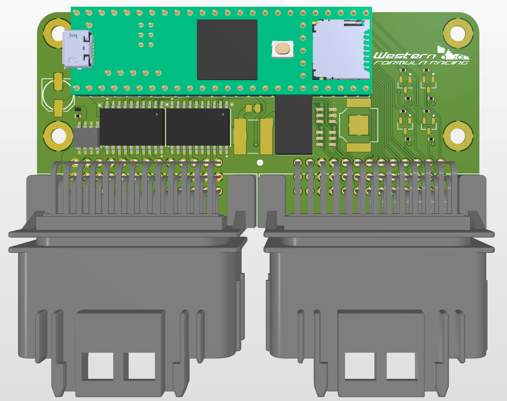

# WFR-24E_ECU

In the WFR-24E FSAE car, this device takes all analog and digital sensor inputs and uses switched power outputs, 5V IO and 2 CAN channels to control all parts of the WFR-24E.
We decided the have 2 controllers onboared to reduce wiring from front to back of the car as this significantly increases the complexity wiring harness complexity.
The car has a 24V low voltage system so the 

Image of Assembled Device:

Image of Inputs Schematic

Image of Digital and PWR Schematic:

Image of Analog Filtering Schematic:

Image of MCU Schematic:

Image of Model:

