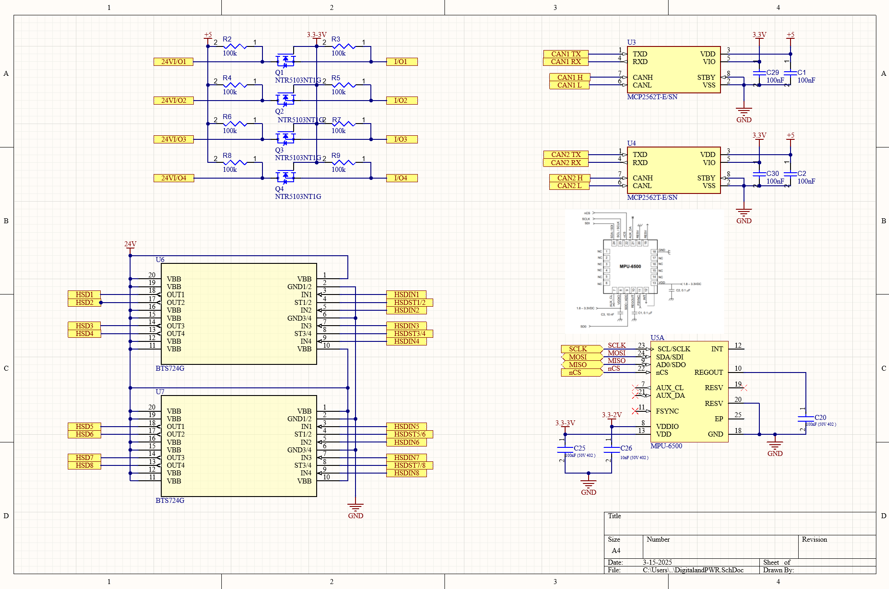

# WFR-24E_ECU

In the WFR-24E FSAE car, this device reads all sensor and controls all parts of the WFR-24E.

We decided the have 2 controllers onboared to reduce wiring from front to back of the car as this significantly increases the complexity wiring harness complexity.
The car has a 24V low voltage system so the input voltage range of the device needed to accomadate this, and the device needed interfaces to measure all sensors and command all outputs.

Sensors were primarally analog with a few digital buttons.
Motor inverter and BMS were communicated over CAN with a couple lights requiring switched power outputs.

The final interfaces chosen for the device were:
| Interface               | Number |
| :---------------------- | :----- |
| CANBUS                  | 2      |
| 5V Analog Inputs        | 18     |
| 5V IO                   | 4      |
| 9-36V 3A Switched Power | 8      |
| 5V 0.5A Sensor Supply   | 1      |

More analog inputs were chosen that required for expansion of our sensor system.

This device also included reverse voltage protection and a PTC self resetable fuse on the sensor 5V supply.

This was able to be designed with a small sealed form factor based on a Teensy 4.1 for reduced scope.
Box was not included in images.

Image of Assembled Device:

Image of Inputs Schematic

Image of Digital and PWR Schematic:

Image of Analog Filtering Schematic:

Image of MCU Schematic:

Image of Model:

